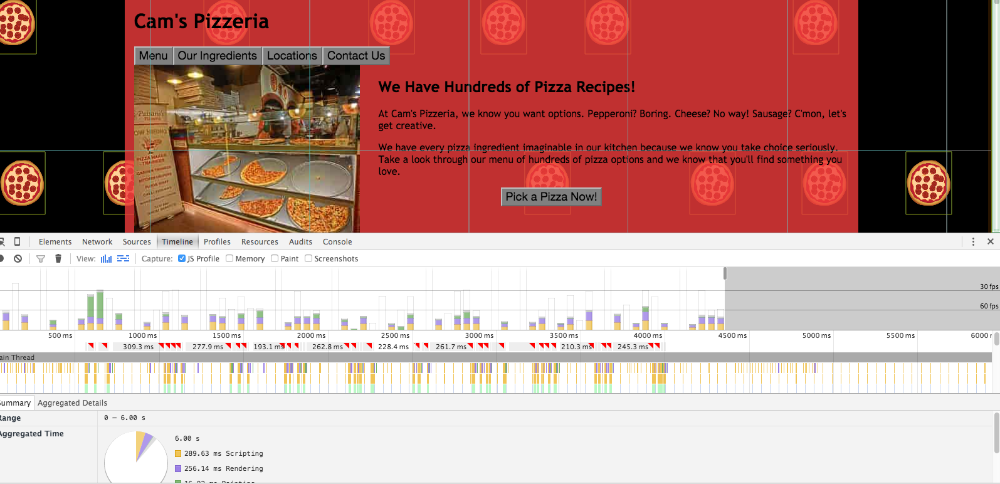

## Website Performance Optimization portfolio project

This project is all about optimizing this online portfolio for speed.

I first started out by optimizing the critical rendering path and made index.html render as quickly as possible. The next challange was to remove jank from the little pizzas when scrolling in pizza.html which automatically gave me a consistent 60 fps frame rate. The last task was to improve the time of resize of pizza when a different size is being selected using the slider. This I was able to improve time from 118ms to 2ms.

### Running and Testing my Project

1. Clone my project from github to a local directory
2. Start a webserver the includes my local directory in the path it will serve the files from.
3. Assuming you have python installed:
  * cd to this local directory
  * in the command line write this: python -m SimpleHTTPServer 8080
4. Open a new window and cd to local directory for my project and write this in the command line: ngrok http 8080

# To review index.html with PageSpeed Insights

Once that is setup copy the ngrok URL displayed in the terminal (it will look something like this: http://9c941fda.ngrok.io) and run it with PAgeSpeeds Insights. Paste the the URL in the "Analyze"  box and click the analyze button.

# To review pizza.html using Chrome Dev Tools

1. Load the localhost directory of file into a browser.
2. Launch Chrome Dev Tools.
3. Check out the TimeLine and Console tabs when scrolling the page and resizing pizzas.

#### Part 1: Optimize PageSpeed Insights score for index.html

Optimize the html and css to achieve a PageSpeed Insights score of 90+ for Mobile and Desktop.

#### Part 2: Optimize Frame per Second in pizza.html

Identify and perform optimizations ensuring a consistent frame rate of 60fps when scrolling in pizza.html.

#### Part 3: Optimize Time to Resize pizzas

The time to resize the menu pizzas (as noted in console.log) should be less than 5ms.

#### Part 4: Use Gulp to Build the project

Use Gulp to build the project and automatically run optimizations such as minify CSS and JS as well as compression and resizing images.

#### Part 5: Create a README files

An outline all the optimizations done in main.js for the pizza.html page.

## Optimizations

1. Loading fonts are costly to optimization. Seeing that there were several fonts being loaded and not used at all (for example: cyrillic, greek, and vietnamese extensions) were removed and there for saving on optimization.

2. Because the css styling had very little inside and since loading external css is rendering blocking, by adding it inline saves time by removing an HTTP request.

3. The image pizzeria.jpg was too large and caused loading time to be longer then it needed. By creating two compressed images, one for a small pizzeria.jpg for index.html and the other a bit larger for pizza.html which allowed for loading time.

4. Since minified files take less time to load use gulp-minify-css, gulp-minify-html, and gulp-uglify plugins to minify the files.

After all these changes, below you can see my score for PageSpeed Insights.

1. In main.js the original was creating 200 little pizzas even though the browser window was displaying only around 35 little pizzas. So I    changed it to only create 35 pizzas, which instantly helped for a 60fps frame rate.

2. Again in main.js I Created a local variable that replaced document.querySelectorAll() to be the faster document.getElementsByClassName By moving var dx and var newwidth out of the for loop since variables should not be inside for loops.

After all these changes below is my timeline after optimization:

